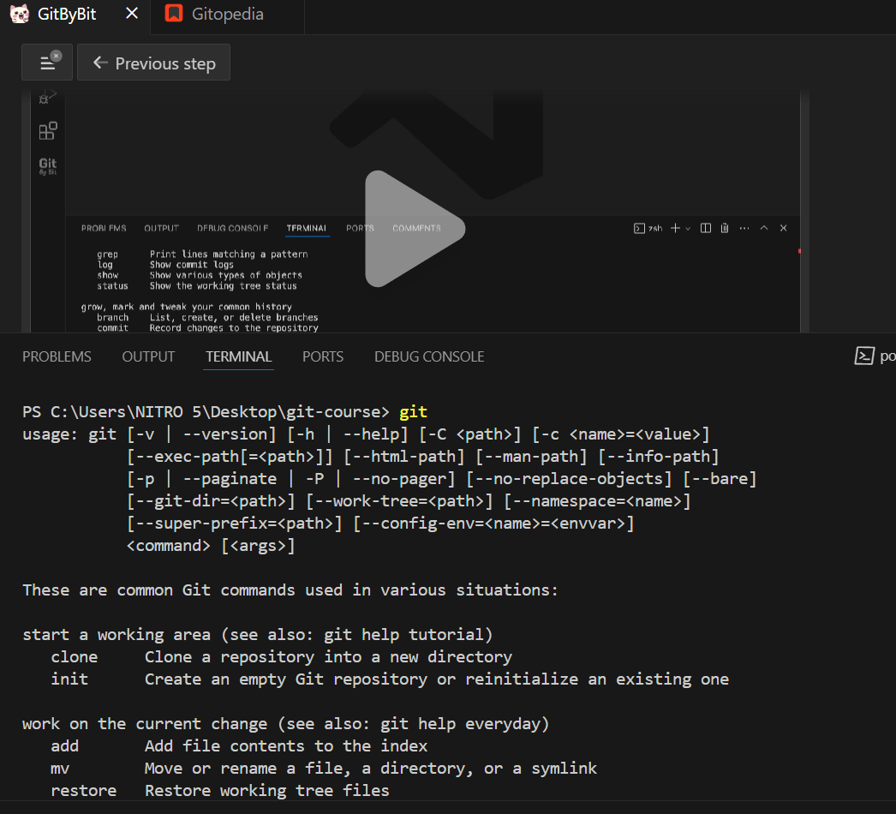
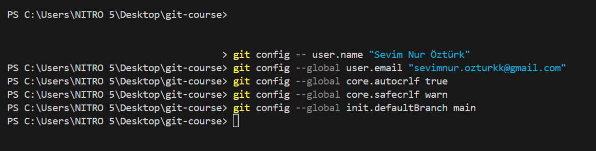
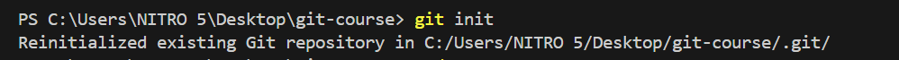
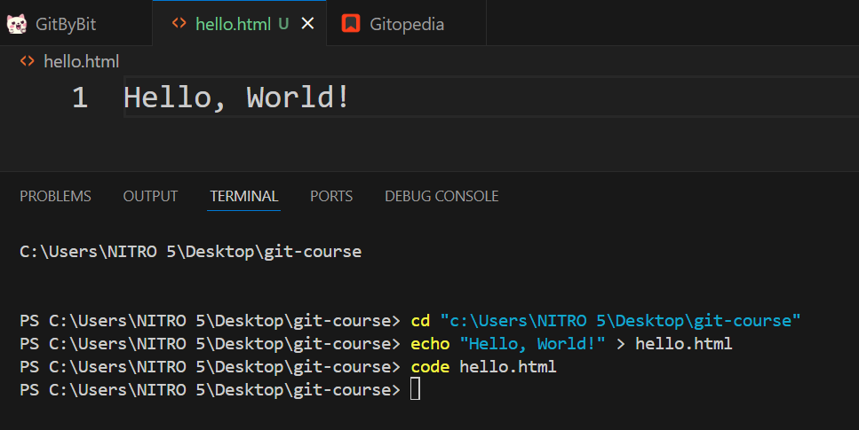
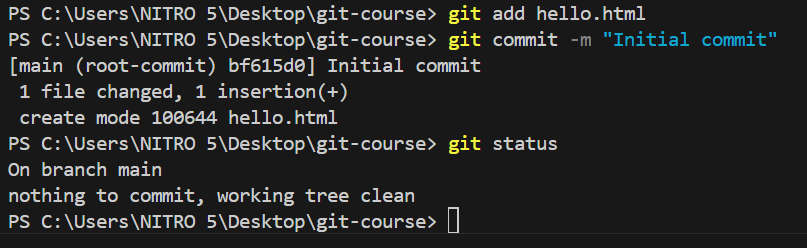
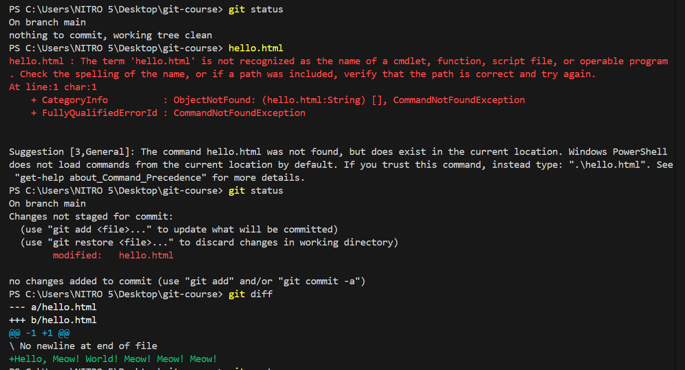
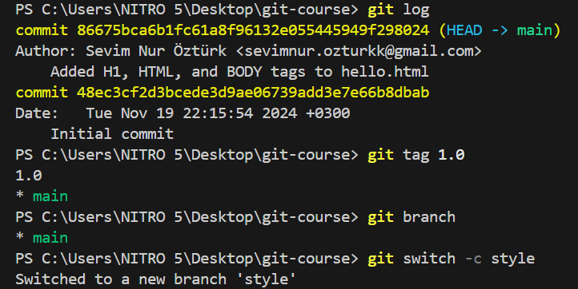
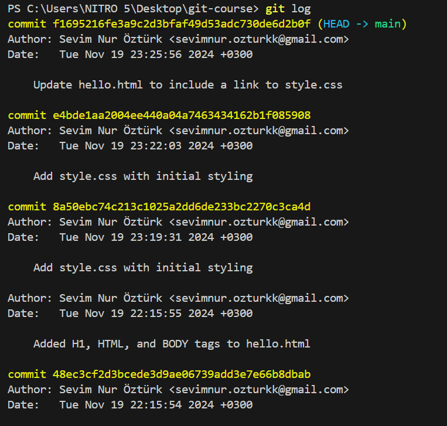

# -git-howto-lecture
# "Studying Git"

### Step 1: Introduction to Version Control

#### Key Topics Covered:
- **What is Version Control?** A system to track changes and manage project history.
- **Why Use Version Control?** Enables collaboration, history tracking, and rollback to previous states.
- **Introduction to Git:** A widely-used, distributed version control system.
- **Git Workflow Example:** Modify, stage, commit, and push changes.

#### Conclusion
Git simplifies collaboration and ensures code safety, making it essential for modern software development.
Here is an example of the commands used in Step 1:

### Step 2: Setting Up Git

#### Key Topics Covered:
- **Installation:** Install Git on your system from [git-scm.com](https://git-scm.com).
- **Command Line Basics:** Use the terminal to execute Git commands.
- **Configuring Credentials:**  
git config --global user.name "Your Name" git config --global user.email "you@example.com"
git config --global core.autocrlf true git config --global init.defaultBranch main
Here is an example of the commands used in Step 2:

### Step 3: Adding files into the repository

In this step, we learned how to add files to a Git repository and manage changes:

#### Initializing a repository
To create a new Git repository in your project folder, run:
git init
git add <file-name> # Or use git add . to add all changes
git commit -m "Your commit message"
git status

### Step4: Resetting Unwanted Changes

In this step, we explored how to manage and undo changes effectively in Git:

#### Comparing the working tree with the repository
To compare your current changes with the latest committed version, use:
git diff
git restore <file-name> # To restore specific files git restore . # To restore all files
git restore --staged <file-name>
git commit --amend -m "Updated commit message"

### Step 5: Tagging and Branching

This step covered how to organize and reference specific points in your project and manage multiple workflows.

#### Referencing Commits
Each commit in Git is uniquely identified by a hash. Use these hashes to reference specific changes or points in your project history.

#### Tags
Tags mark important points in your project's history, such as releases:
- **Create a tag:**  
git tag <tag-name>
git branch <branch-name>
git switch <branch-name>
git switch main
git merge <branch-name>

### Step 6: History

This step focused on understanding and managing the history of a Git repository.

#### Browsing History
Review the history of commits to track changes over time:
- **View commit history:**  
git log
git log --oneline
git diff
git revert <commit-hash>
git reset --soft <commit-hash>
git reset --hard <commit-hash>

### Step 7: Remotes and GitHub

This step covered the essentials of working with remote repositories and interacting with GitHub.

#### What Is a Remote Repository?
A remote repository is a version of your project hosted on a server, enabling collaboration and backup.

#### Adding GitHub Repository as a Remote
To connect a local repository to a GitHub repository:
- **Add a remote repository:**
- git remote add origin <repository-URL>
git push origin <branch-name>
git pull origin <branch-name>

